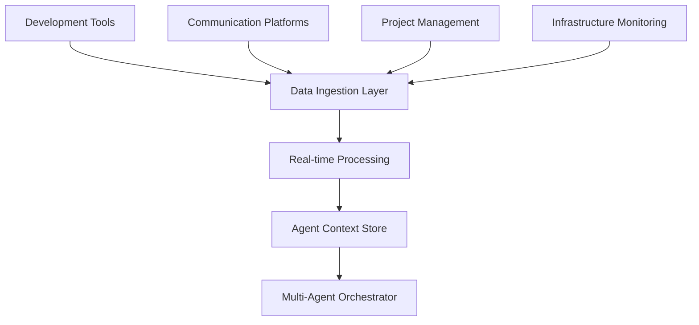

# How It Works: Agentic Engineering Management

## Core Concept

The Engineering Manager Toolkit operates as a **multi-agent AI system** that continuously monitors, measures, and optimizes engineering team performance across four critical dimensions:

- 📊 **Performance**: Team velocity, delivery predictability, quality metrics
- 💰 **Cost**: Resource utilization, infrastructure efficiency, time optimization  
- 🔒 **Security**: Vulnerability management, compliance, risk assessment
- 🚀 **Delivery**: Sprint execution, release cadence, stakeholder satisfaction

## How the Agentic System Functions

### 1. Continuous Data Collection

The system operates through **passive monitoring** and **active data gathering**:



**Data Sources:**
- Git commits, PR reviews, code quality metrics
- Slack/Teams messages, meeting transcripts, sentiment analysis
- Jira tickets, sprint velocity, story completion rates  
- CI/CD pipelines, deployment frequency, failure rates
- Infrastructure costs, resource utilization, SLI/SLO metrics

### 2. Agent Specialization & Coordination

Each agent specializes in one domain but **shares context** with others:

#### SCRUM_MASTER Agent
```yaml
Responsibilities:
  - Sprint planning automation
  - Velocity trend analysis  
  - Delivery risk prediction
  - Burndown anomaly detection

Metrics Tracked:
  - Story points completed vs. committed
  - Cycle time (story start → done)
  - Defect escape rate
  - Sprint goal achievement rate

Actions Taken:
  - Auto-generate next sprint plan
  - Alert on velocity degradation
  - Suggest scope adjustments
  - Escalate delivery risks
```

#### PEOPLE_OPS Agent  
```yaml
Responsibilities:
  - Performance trend monitoring
  - 1:1 agenda optimization
  - Team satisfaction tracking
  - Skill gap identification

Metrics Tracked:
  - Code review feedback quality
  - Collaboration network analysis
  - Learning velocity (new skills acquired)
  - Retention risk indicators

Actions Taken:
  - Generate personalized 1:1 topics
  - Recommend career development paths
  - Alert on engagement drops
  - Suggest team restructuring
```

#### CODE_GUARDIAN Agent
```yaml
Responsibilities:
  - Technical debt accumulation monitoring
  - Security vulnerability triage
  - Code quality trend analysis
  - Architecture compliance checking

Metrics Tracked:
  - Technical debt ratio (debt/total code)
  - Security vulnerability MTTR
  - Code review approval time
  - Test coverage trends

Actions Taken:
  - Prioritize tech debt remediation
  - Auto-assign security vulnerabilities  
  - Block deployments on quality gates
  - Generate architecture improvement plans
```

### 3. Real-Time Performance Measurement

The system measures team performance through **leading and lagging indicators**:

#### Performance Metrics Dashboard
```
┌─────────────────────────────────────────────────┐
│ TEAM PERFORMANCE SNAPSHOT                       │
├─────────────────────────────────────────────────┤
│ Velocity Trend:        ▲ +15% (last 4 sprints) │
│ Delivery Predictability:  92% (target: >85%)   │
│ Code Quality Score:       8.4/10 (trending ↑)  │
│ Team Satisfaction:        7.8/10 (stable)      │
│ Security Posture:         🟢 Low Risk           │
│ Infrastructure Cost:   £12,450/month (-8%)     │
└─────────────────────────────────────────────────┘
```

#### Cost Optimization Engine
```python
class CostOptimizer:
    def analyze_team_efficiency(self):
        # Infrastructure costs per story point delivered
        cost_per_sp = monthly_infra_cost / avg_story_points
        
        # Developer time utilization
        coding_time_pct = time_coding / total_work_time
        
        # Meeting efficiency score  
        meeting_roi = outcomes_achieved / meeting_hours
        
        # Resource recommendation engine
        return self.optimize_resource_allocation()
```

### 4. Intelligent Alerting & Recommendations

The agents don't just measure—they **proactively recommend actions**:

#### Smart Alert Examples
```yaml
Performance Alerts:
  velocity_drop:
    trigger: "Velocity decreased >20% over 2 sprints"
    recommendations:
      - "Review recent scope changes in backlog"
      - "Check team capacity vs. external interruptions"
      - "Schedule technical debt reduction sprint"
    
  quality_degradation:
    trigger: "Bug escape rate >10% for current sprint"
    recommendations:  
      - "Increase code review requirements"
      - "Add automated testing gates"
      - "Schedule quality improvement retrospective"

Cost Alerts:
  infrastructure_spike:
    trigger: "Monthly cost increased >15% without velocity increase"
    recommendations:
      - "Review unused resources and auto-scaling policies"
      - "Optimize database query patterns"
      - "Consider reserved instance purchases"
```

### 5. Continuous Learning & Adaptation

The system **learns from team patterns** and **adapts recommendations**:

#### Learning Mechanisms
- **Pattern Recognition**: Identifies what conditions lead to successful sprints
- **Correlation Analysis**: Links team practices to outcome metrics
- **Predictive Modeling**: Forecasts delivery risks and resource needs  
- **Feedback Integration**: Incorporates manager and team feedback into models

#### Adaptation Examples
```python
class AdaptivePlanning:
    def adjust_estimates_based_on_history(self, story):
        # Learn from similar stories completed by this team
        historical_data = self.get_similar_stories(story.tags, story.complexity)
        
        # Adjust estimate based on team velocity patterns
        team_factor = self.calculate_team_efficiency_factor()
        
        # Account for external factors (holidays, tech debt, etc.)
        context_adjustments = self.get_context_factors()
        
        return story.estimate * team_factor * context_adjustments
```

### 6. Executive-Level Intelligence

The system rolls up insights for **strategic decision making**:

#### Executive Dashboard
```
┌──────────────────────────────────────────────────────┐
│ ENGINEERING ORGANIZATION HEALTH - Q1 2026           │
├──────────────────────────────────────────────────────┤
│                                                      │
│ 📈 DELIVERY PERFORMANCE                             │
│    • On-time delivery: 94% (↑ 12% vs Q4)           │
│    • Feature velocity: 47 stories/sprint (↑ 23%)   │
│    • Customer satisfaction: 8.7/10 (↑ 0.4)         │
│                                                      │
│ 💰 COST EFFICIENCY                                  │
│    • Cost per feature: £8,200 (↓ 18% vs Q4)        │
│    • Infrastructure optimization: £34K saved        │
│    • Developer productivity: 73% coding time        │
│                                                      │
│ 🔒 SECURITY & QUALITY                               │
│    • Security vulnerability MTTR: 3.2 days (↓ 45%) │
│    • Code quality score: 8.9/10 (↑ 1.1)           │
│    • Technical debt ratio: 14% (↓ 6%)              │
│                                                      │
│ 👥 TEAM HEALTH                                       │
│    • Employee satisfaction: 8.4/10 (↑ 0.7)         │
│    • Retention rate: 96% (↑ 8%)                     │
│    • Internal promotion rate: 28% (↑ 12%)          │
│                                                      │
└──────────────────────────────────────────────────────┘
```

## Implementation Architecture

### Agent Communication Protocol
```python
class AgentCommunication:
    def share_context(self, event_type, data, priority='normal'):
        """
        Agents communicate through structured events:
        - PERFORMANCE_CHANGE: Velocity, quality metrics  
        - COST_ANOMALY: Infrastructure or time efficiency
        - SECURITY_INCIDENT: Vulnerabilities, compliance
        - DELIVERY_RISK: Sprint or release concerns
        """
        
        # Broadcast to relevant agents
        interested_agents = self.get_agents_for_event(event_type)
        for agent in interested_agents:
            agent.process_event(event_type, data, priority)
```

### Decision Making Framework
```python
class ManagementDecisionEngine:
    def recommend_action(self, context):
        # Gather inputs from all agents
        scrum_input = self.scrum_master.analyze_delivery_trends()
        people_input = self.people_ops.analyze_team_health()
        code_input = self.code_guardian.analyze_quality_trends()
        
        # Weight recommendations by impact and confidence
        recommendations = self.prioritize_actions([
            scrum_input, people_input, code_input
        ])
        
        # Generate executive summary with options
        return self.format_decision_package(recommendations)
```

## Key Success Patterns

### 1. Proactive vs Reactive Management
- **Traditional**: Respond to issues after they impact delivery
- **Agentic**: Predict and prevent issues before they occur

### 2. Data-Driven vs Intuition-Based Decisions  
- **Traditional**: Rely on manager experience and gut feelings
- **Agentic**: Combine manager judgment with comprehensive data analysis

### 3. Siloed vs Holistic Team View
- **Traditional**: Separate tools and metrics for different aspects
- **Agentic**: Unified view of team performance across all dimensions

### 4. Manual vs Automated Optimization
- **Traditional**: Manager manually identifies and addresses inefficiencies  
- **Agentic**: Continuous automated optimization with manager oversight

## ROI Impact Measurement

The system tracks its own effectiveness:

```yaml
Management Time Savings:
  - Sprint planning: 4 hours → 30 minutes (87% reduction)
  - Performance reviews: 8 hours → 2 hours (75% reduction) 
  - Technical planning: 6 hours → 1 hour (83% reduction)
  - Status reporting: 5 hours → automated (100% reduction)

Team Performance Improvements:
  - Delivery predictability: 73% → 92% (+19 percentage points)
  - Defect escape rate: 12% → 4% (-67% reduction)
  - Time to deploy: 3.2 days → 0.8 days (75% reduction)
  - Security vulnerability MTTR: 12 days → 3 days (75% reduction)

Cost Optimizations:
  - Infrastructure waste reduction: 15-25%
  - Developer productivity increase: 20-30%  
  - Hiring efficiency improvement: 40-60%
  - Incident response cost reduction: 50-70%
```

## Next Steps

This agentic system transforms engineering management from **reactive coordination** to **proactive optimization**, enabling managers to focus on strategic decisions while AI handles operational excellence.

The result: **Higher performing teams, lower costs, better security, and predictable delivery**—all with less management overhead.